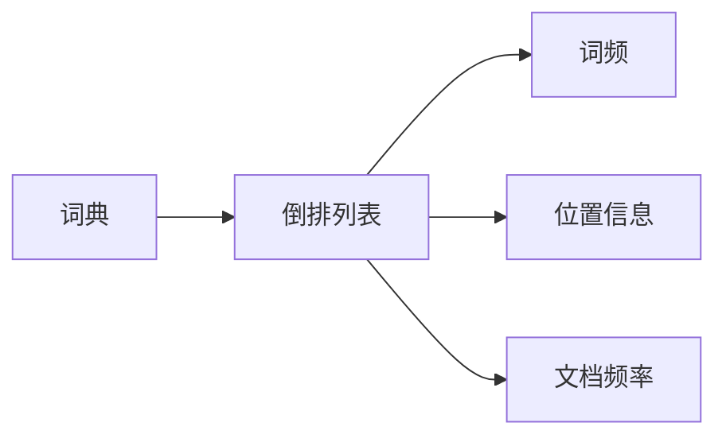

# 核心流程
Lucene包含以下核心流程
- 索引
- 查询

## 索引流程
在索引过程中，会经历以下步骤：
- 文档建模：用一个数据结构描述文档，并抽取文档标题，作者，时间，内容等关键信息
- 文本分析：将文本内容利用分析器，拆分成一个个词，同时进行如小写话，去停用词，词干提取等处理
- 建立倒排索引：核心是以词为索引的key，通过词找到文档
- 索引存储：将倒排索引存储到磁盘上


## 查询流程
> 以最简单的一个词查询，不包含组合条件为例

在查询流程中，会经历以下步骤：
- 利用查询的query词在索引中找到匹配的文档
- 为每篇找到的文章计算一个和query的相关性得分
- 返回结果

### 复杂的查询条件
实际情况，用户的查询条件可能会比较复杂，例如：[Google的高级查询功能](https://www.google.com/advanced_search)，可以选择语言，地区，排除部分关键词等。


所以需要在查询之前，对查询语句进行解析，完整流程如下：


# 关键问题
## 如何根据一句话检索文章？
如果只有一个词，我们很好理解，就是直接把这个词当做索引，类似数据库根据索引检索行记录一样。但是如果是一句话，应该怎么办呢？

以query `24年3月份创作的和Java以及Spring相关的文章` 为例，来说明这个过程。

- 先通过语义解析，定义查询内容为：
  - date：存储文章的创作日期。`value=202403*`
  - content：存储文章的内容。`value=Java AND Spring`
- 根据date条件找到所有创作时间为2024年3月份的文章集合A
- 根据content条件，找到包含Java和Spring内容的文章集合B
- 将两个文章取交集

```java
Query query = parser.parse("date:202403* AND content:(Java AND Spring)");
IndexSearcher searcher = new IndexSearcher(directoryReader);
TopDocs topDocs = searcher.search(query, 10);  // 查找匹配的前10个结果
```

## 如何计算query和文档的相关性
简单来说分为以下四步


关于如何计算TF-IDF，以及为什么要TF-IDF可以作为相似度度量，见[文章](https://www.journeypeng.best/posts/learn-tf-idf)

# 优化
从四个点展开，这也是一般程序的优化框架：
- 提升速度
  - 研究索引优化技术，例如：索引分片，合并策略等
  - 研究缓存技术
  - 研究合适的数据结构和算法
- 提升负载
  - 研究Lucene集群，例如ElasticSearch
- 提升稳定性
  - 研究数据备份和恢复等
- 提升功能
  - 研究支持更复杂的查询

# 倒排索引是什么？

简单来说，利用词来找文档数据结构，核心组件是：词典和倒排列表，倒排列表中又包含了词频，位置信息，文档频率等。


词频：这个词在这个文档中出现的次数

文档频率：包含这个词的文档数量

# 探索性问题

- 什么是词干提取？去停用词中停用词指的是什么？
