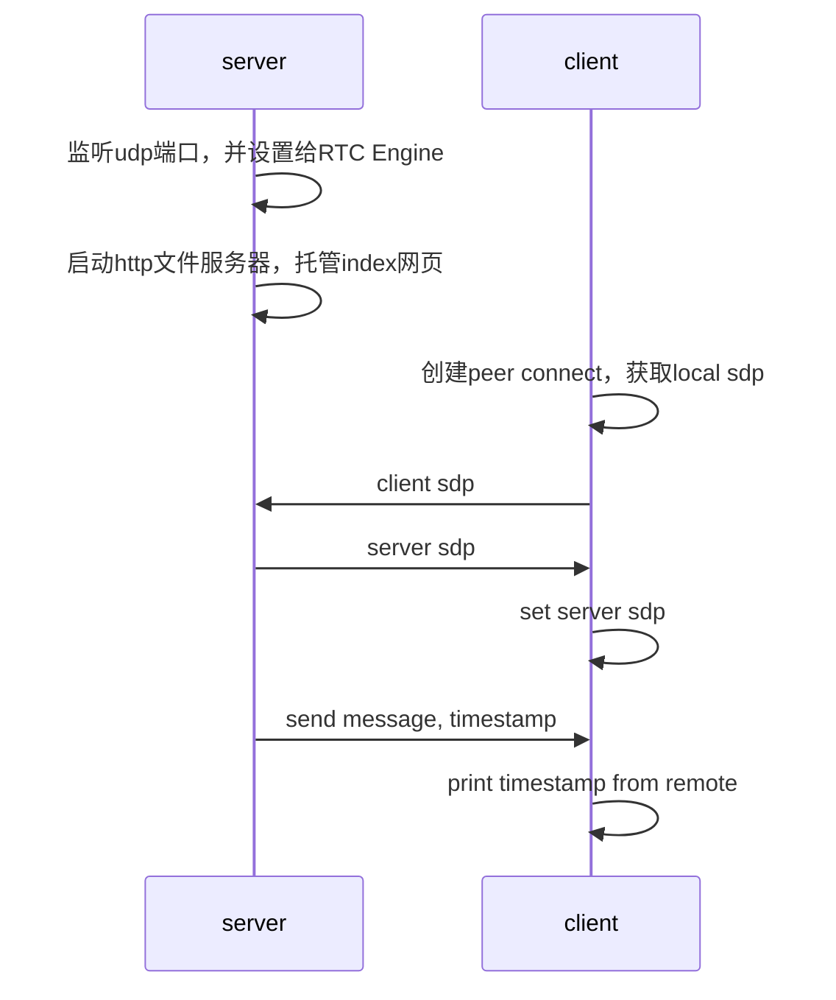

@[toc]
# example说明
这个example是一个用来展示功能：可以在相同的udp端口上连接不同的客户端PeerConnection，每个客户端的PeerConnection的端口是客户端自己生成的，服务器的端口是最开始就确定好的，并且被所有的客户端生成。

此外，这个example还模拟了通过datachannel做基本的数据收发。有一个相对比较完整的流程，可以作为入门参考。

## 整体流程


> index.html网页中会在网页打开的时候，创建peer connection，获取client sdp，然后给server发消息，获取server sdp；监听远程的消息
> 为了简化说明，server sdp指的是服务器自己产生的sdp，client sdp指的是客户端自己产生的sdp


# 源码

源码地址：https://github.com/pion/webrtc/tree/master/examples/ice-single-port

## 拆解
### server
#### 打开本地的udp listener
```go
udpListener, err := net.ListenUDP("udp", &net.UDPAddr{  
   IP:   net.IP{0, 0, 0, 0},  
 Port: 8443,  
})  
if err != nil {  
   panic(err)  
}
```
#### 通过setting engine设置listener
```go
// Create a SettingEngine, this allows non-standard WebRTC behavior  
// 创建SettingEngine，通过SettingEnginen，能够允许非标准的WebRTC流程，比如说固定ice的端口
settingEngine := webrtc.SettingEngine{}  
  
// Configure our SettingEngine to use our UDPMux. By default a PeerConnection has  
// no global state. The API+SettingEngine allows the user to share state between them.  
// In this case we are sharing our listening port across many.  
// 设置UDPMux，即UDP复用器，允许不同的peer connection共享相同的端口
settingEngine.SetICEUDPMux(webrtc.NewICEUDPMux(nil, udpListener))  
  
// Create a new API using our SettingEngine  
// 使用settingEngine创建webrtc api。后续可以通过这个api完成双向通信
// 这个api是个全局变量，可以在接收到远端的sdp offer之后调用处理
api = webrtc.NewAPI(webrtc.WithSettingEngine(settingEngine))
```

#### 托管本地index
```go
http.Handle("/", http.FileServer(http.Dir(".")))
```

这里的pwd目录下面有一个index.html文件，里面就是一会会说到的client的逻辑，在web sdk中非常有代表性

#### 接受client sdp的http接口
这里的doSignaling接口实现的就是一个最简单的webrtc 信令服务器。传送了双方建立连接所需要的最基本的信息
```go
http.HandleFunc("/doSignaling", doSignaling)
```

官方示例中没有给出这个协议的具体内容，这里做一个补充

**request**

```HTTP
POST /doSignaling HTTP1.1

{
	"type": "offer",
	"sdp": "<sdp string>"
}
```

**response**

```json
{
	"type": "answer",
	"sdp": "<sdp string>"
}
```

##### doSignaling
简单说来，就是利用之前创建的webrtc api，和收到的sdp，创建peerConnection，等待客户端的ice通道建立完成，然后将自己的sdp送给客户端
```go
func doSignaling(w http.ResponseWriter, r *http.Request) {  
   peerConnection, err := api.NewPeerConnection(webrtc.Configuration{})  
   if err != nil {  
      panic(err)  
   }  
  
   // Set the handler for ICE connection state  
 // This will notify you when the peer has connected/disconnected peerConnection.OnICEConnectionStateChange(func(connectionState webrtc.ICEConnectionState) {  
      fmt.Printf("ICE Connection State has changed: %s\n", connectionState.String())  
   })  
  
   // Send the current time via a DataChannel to the remote peer every 3 seconds  
 peerConnection.OnDataChannel(func(d *webrtc.DataChannel) {  
      d.OnOpen(func() {  
         for range time.Tick(time.Second * 3) {  
            if err = d.SendText(time.Now().String()); err != nil {  
               panic(err)  
            }  
         }  
      })  
   })  
  
   var offer webrtc.SessionDescription  
 if err = json.NewDecoder(r.Body).Decode(&offer); err != nil {  
      panic(err)  
   }  
  
   if err = peerConnection.SetRemoteDescription(offer); err != nil {  
      panic(err)  
   }  
  
   // Create channel that is blocked until ICE Gathering is complete  
 gatherComplete := webrtc.GatheringCompletePromise(peerConnection)  
  
   answer, err := peerConnection.CreateAnswer(nil)  
   if err != nil {  
      panic(err)  
   } else if err = peerConnection.SetLocalDescription(answer); err != nil {  
      panic(err)  
   }  
  
   // Block until ICE Gathering is complete, disabling trickle ICE
   // we do this because we only can exchange one signaling message
   // in a production application you should exchange ICE Candidates via OnICECandidate
   <-gatherComplete  
  
   response, err := json.Marshal(*peerConnection.LocalDescription())  
   if err != nil {  
      panic(err)  
   }  
  
   w.Header().Set("Content-Type", "application/json")  
   if _, err := w.Write(response); err != nil {  
      panic(err)  
   }  
}
```


#### 启动http服务
```go
panic(http.ListenAndServe(":8080", nil))
```

同时开启
- index.html托管服务
- 接受client sdp的http接口服务

### client
#### 创建datachannel
```javascript
let pc = new RTCPeerConnection()  
let dc = pc.createDataChannel('data')
```

#### 打印远端candidate信息
```javascript
dc.onopen = () => {  
  let el = document.createElement('template')  
  let selectedPair = pc.sctp.transport.iceTransport.getSelectedCandidatePair()  
  
  el.innerHTML = `<div>  
 <ul> <li> <i> Local</i> - ${selectedPair.local.candidate}</li>  
 <li> <i> Remote</i> - ${selectedPair.remote.candidate} </li> </ul> </div>`
    document.getElementById('iceSelectedPairs').appendChild(el.content.firstChild);  
}
```

#### 创建本地sdp，发送给服务器，并设置服务器sdp
```javascript
pc.createOffer()  
  .then(offer => {  
    pc.setLocalDescription(offer)  
  
    return fetch(`/doSignaling`, {  
      method: 'post',  
 headers: {  
        'Accept': 'application/json, text/plain, */*',  
 'Content-Type': 'application/json'  
 },  
 body: JSON.stringify(offer)  
    })  
  })  
  .then(res => res.json())  
  .then(res => pc.setRemoteDescription(res))  
  .catch(alert)
```